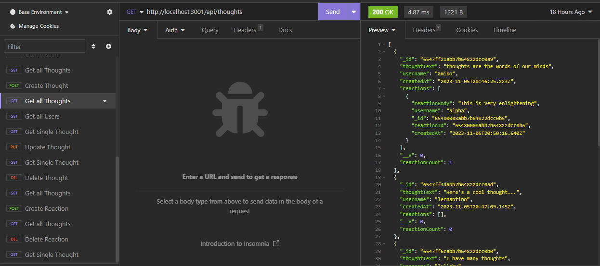

# trevors-social-network-api  
  

## Description  
An api for social networks that allows users to share their thoughts, react to friends’ thoughts, and create a friend list.   

## Table of Contents  
* [Installation](#installation)  
* [Usage](#usage)  
* [Credits](#credits)  
* [License](#license)  
* [Contributing](#contributing) 
* [Questions](#questions)

## Installation  
To install necessary dependencies, run the following command:  

```  
npm install  
```  

## Usage  
To run the program type ```npm start``` in your console while in the base route of the directory.  Open up insomnia afterwards.  You will then be able to create a get, post, put, and delete requests with the paths of /api/users, /api/users/:userId, /api/users/:userId/friends/:friendId, /api/thoughts, /api/thoughts/:thoughtId, /api/thoughts/:thoughtId/reactions, or /api/thoughts/:thoughtId/reactions/:reactionId.  These paths will allow you to create a new user, create a thought, create a reaction, add another user to the friend list, update a user, update a thought, remove a friend, delete a reaction, delete a user, delete a thought, get all or a single user, and get all or a single thought.   
To seed the starting data run ```npm run seed```  
Walkthrough Video:  
https://drive.google.com/file/d/1S4iyrmIZ3ZoWeDJWJs-_n976nDRQj_nS/view?usp=sharing    
User get requests:   
   
  
User post requests:   
   
   
User put requests:    
   
User delete requests:   
   
   
Thought get requests:   
    
    
Thought post requests:   
    
  
Thought put requests:   
   
Thought delete requests:   
    
    

## Credits  
Created by: Trevor Blanchard  
Link to repo: https://github.com/blanchardt/trevors-social-network-api   
Link to heroku site: https://trevors-social-network-api-547bac35541a.herokuapp.com/  

## License  
This project is licensed under the MIT license.  

## Questions  
If you have any questions about the repo, open an issue or contact me directly at blanchardt@merrimack.edu.  You can find more of my work at [blanchardt](https://github.com/blanchardt/).  